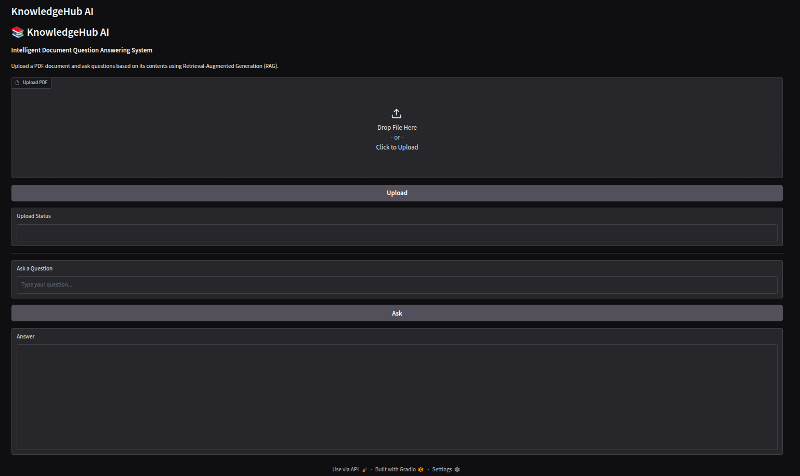
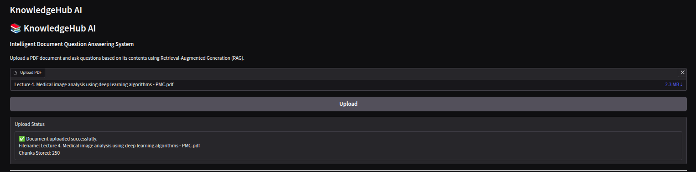
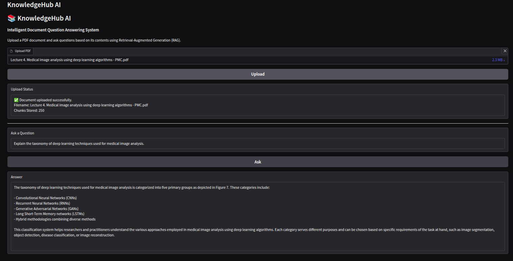
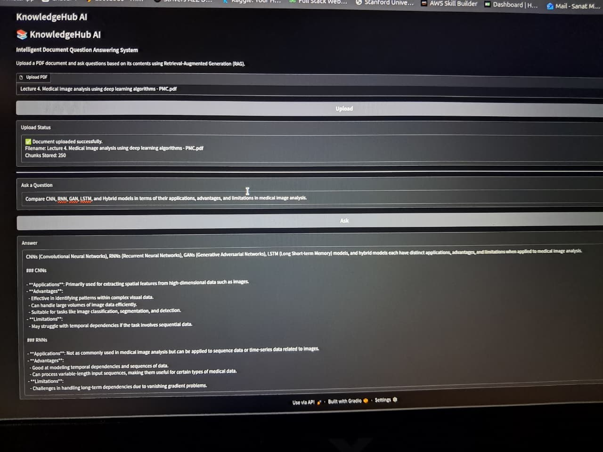
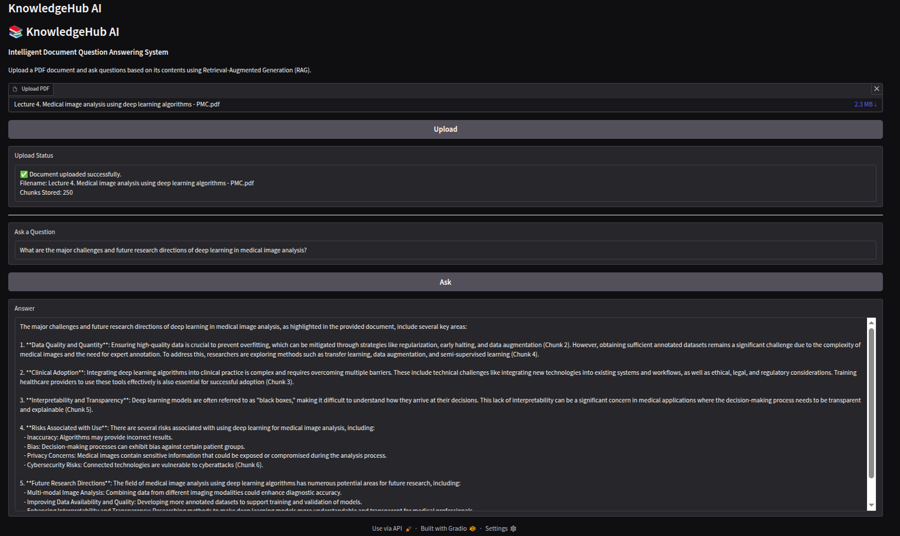

# 📚 KnowledgeHub AI


KnowledgeHub AI is a Retrieval-Augmented Generation (RAG) application that enables users to upload PDF documents and ask natural language questions based solely on the uploaded content.

The project combines semantic search with a local Large Language Model (LLM) to generate accurate, context-aware responses.

---

## ✨ Features

- Upload PDF documents
- Automatic text extraction and cleaning
- Intelligent text chunking
- Semantic embeddings using Sentence Transformers
- ChromaDB vector database for retrieval
- Context-aware question answering using Ollama
- FastAPI backend
- Gradio-based user interface

---

## 🛠️ Tech Stack

- Python
- FastAPI
- Gradio
- ChromaDB
- Sentence Transformers
- Ollama
- PyMuPDF

---

## 📂 Project Structure

```text
knowledgehub-ai/
│
├── assets/
├── core/
├── routes/
├── services/
├── utils/
├── uploads/
│
├── main.py
├── gradio_app.py
├── requirements.txt
└── README.md
```

---

## ⚙️ Installation

### 1. Clone the repository

```bash
git clone https://github.com/sanatmanas13/knowledgehub-ai.git
cd knowledgehub-ai
```

### 2. Create a virtual environment

```bash
python -m venv .venv
```

Activate the environment.

**Windows**

```bash
.venv\Scripts\activate
```

**Linux / macOS**

```bash
source .venv/bin/activate
```

### 3. Install dependencies

```bash
pip install -r requirements.txt
```

### 4. Install and start Ollama

Download Ollama from:

https://ollama.com

Pull your preferred model:

```bash
ollama pull llama3.2
```

Start Ollama:

```bash
ollama serve
```

---

## ▶️ Running the Project

### Start the FastAPI Backend

```bash
uvicorn main:app --reload
```

Backend:

```text
http://127.0.0.1:8000
```

### Start the Gradio Interface

Open another terminal.

```bash
python gradio_app.py
```

Frontend:

```text
http://127.0.0.1:7860
```

---

## 🚀 Usage

1. Launch the FastAPI backend.
2. Launch the Gradio application.
3. Upload a PDF document.
4. Wait for processing to complete.
5. Ask questions related to the uploaded document.
6. Receive AI-generated answers grounded in the document.

---

# 📸 Application Demo

### Home Screen

The Gradio interface allows users to upload PDF documents and ask questions using natural language.



---

### Document Processing

After uploading a PDF, the system extracts text, cleans it, creates semantic chunks, generates embeddings, and stores them in ChromaDB.



---

### Demo 1 – Deep Learning Taxonomy

The system retrieves relevant document chunks and explains the taxonomy of deep learning techniques used in medical image analysis.



---

### Demo 2 – Model Comparison

KnowledgeHub AI compares CNN, RNN, GAN, LSTM, and Hybrid models by retrieving and combining information from multiple sections of the document.



---

### Demo 3 – Challenges & Future Directions

The application generates a comprehensive answer by retrieving context related to current challenges and future research directions in medical image analysis.



---

## 📖 System Workflow

```text
                User
                  │
                  ▼
          Gradio Interface
                  │
            HTTP Requests
                  │
                  ▼
          FastAPI Backend
          /upload   /ask
             │          │
             ▼          ▼
      PDF Extraction  Question
             │          │
             ▼          ▼
      Text Cleaning  Embedding
             │          │
             ▼          ▼
        Text Chunking  ChromaDB
             │          │
             ▼          ▼
 Sentence Transformer  Retrieve Context
             │          │
             └──────┬───┘
                    ▼
                 Ollama
                    │
                    ▼
           Generated Answer
```

---

## 🔮 Future Improvements

- Multi-document support
- User authentication
- Cloud deployment
- Multiple LLM support
- Chat history
- Streaming responses
- Source citations with page numbers
- Hybrid search (Keyword + Semantic Search)

---

## 👨‍💻 Author

**Sanat Manas**

GitHub: https://github.com/sanatmanas13
